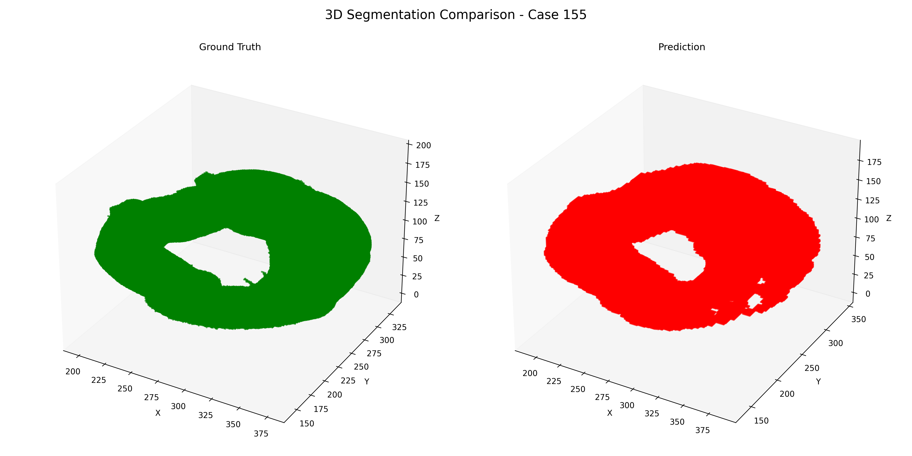
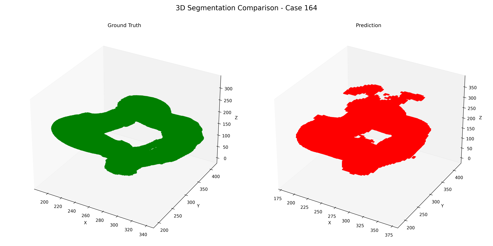
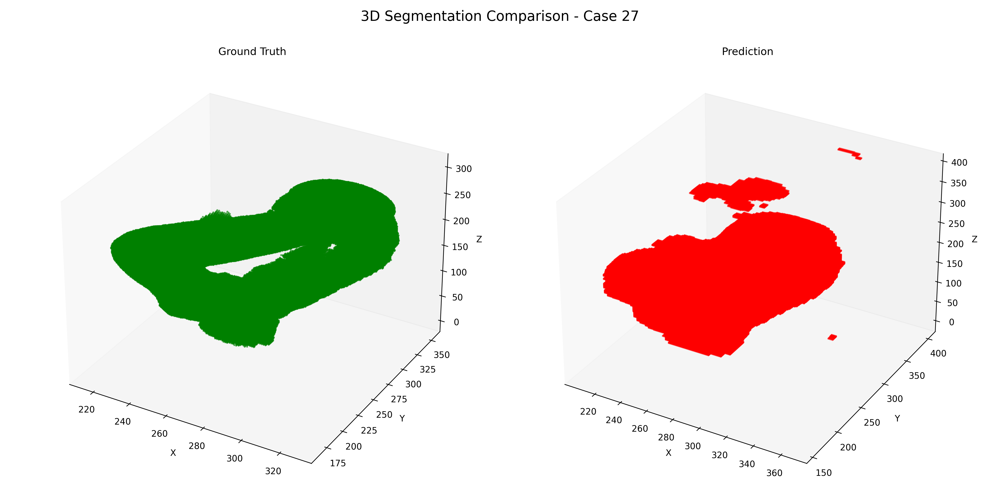

# Task 1: Vessel Segmentation Using Pretrained U-Net with ResNet50 Encoder

## Objective
Segment **Vessel** from a 3D CTA data.

## Dataset Selection
The dataset(https://www.kaggle.com/datasets/xiaoweixumedicalai/imagetbad) consists of annotated  true lumen (TL), false lumen (FL), and false lumen thrombus(FLT), whose top and bottom are around the neck and the brachiocephalic vessels, respectively, in the axial view.

## Approach
1. **Dataset Preparation**:
   1. The Dataset consist of split zip files so they first needs to be concatednated and unziped
   2. Split randomly in training, testing and validation splits in the ration 70:20:10
   3. Here are the notebooks to do so:
      https://www.kaggle.com/code/howndown/compress-labels and https://www.kaggle.com/code/howndown/compress-images/notebook
2. **Model Training**:
   1. Fine-tuning UNet pretrained on vessel segmentation.
   2. Pretraining notebook: https://www.kaggle.com/code/chihjungwang/retina-segmentation-by-pytorch-f1-score-80
   3. For ease of training set the labels to background(0) and vessel(1)
3. **Inference and Evaluation**:
   1. Load the best weights for validation set
   2. Running the trained model on test data.

## Results
The model achieves a ``Average Dice: 66.06``, ``Average IoU: 49.62`` on the test set

## Visualization

## Demo
Demo of using the code: https://www.kaggle.com/code/howndown/final-training-working/notebook
