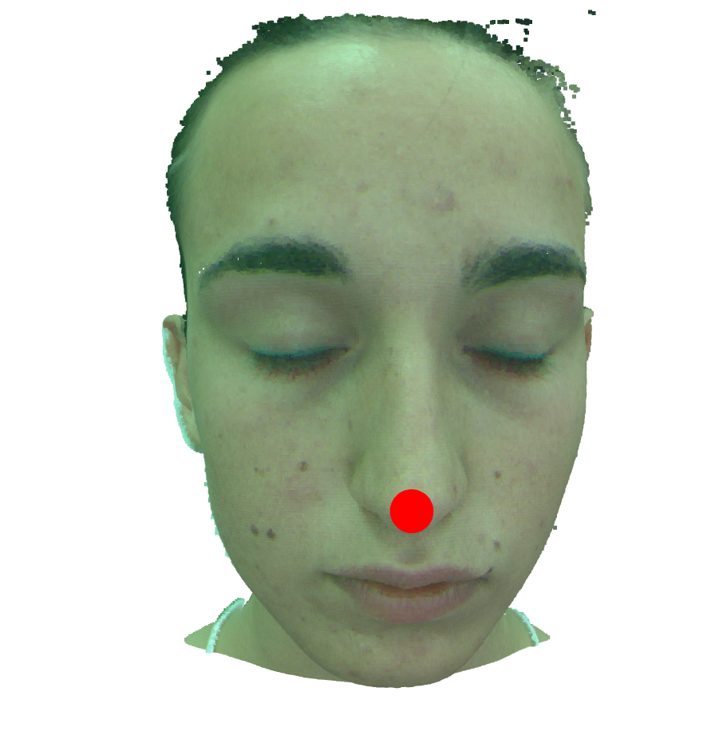
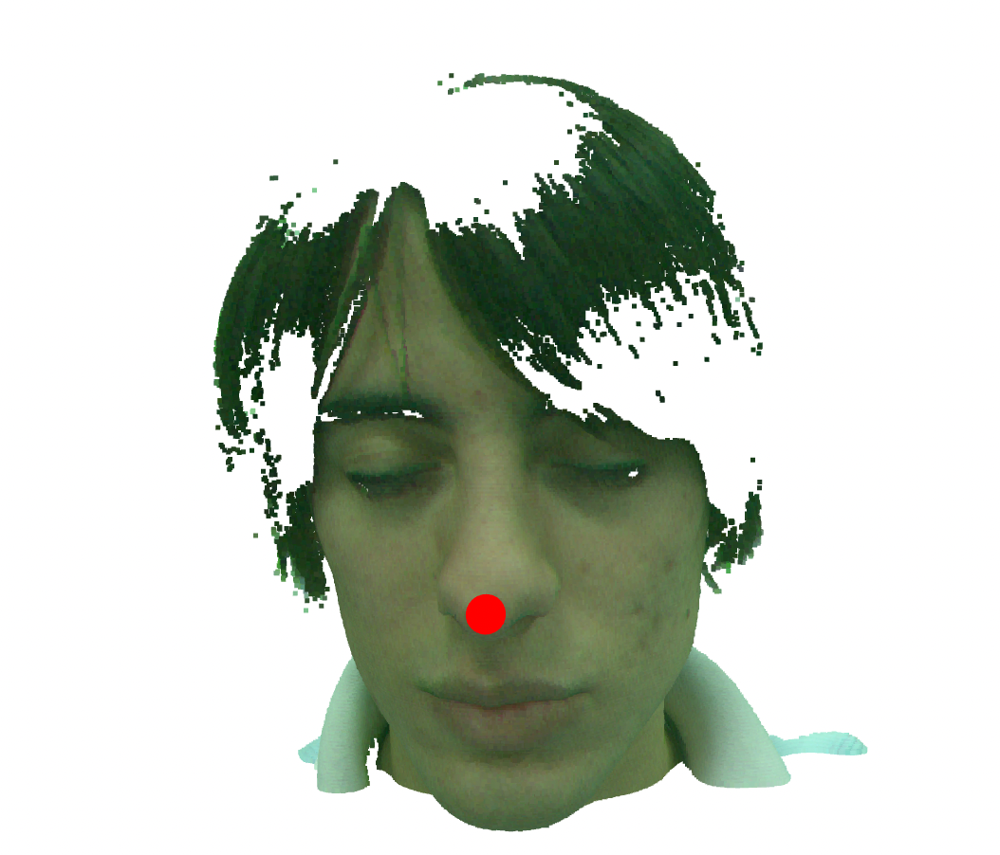
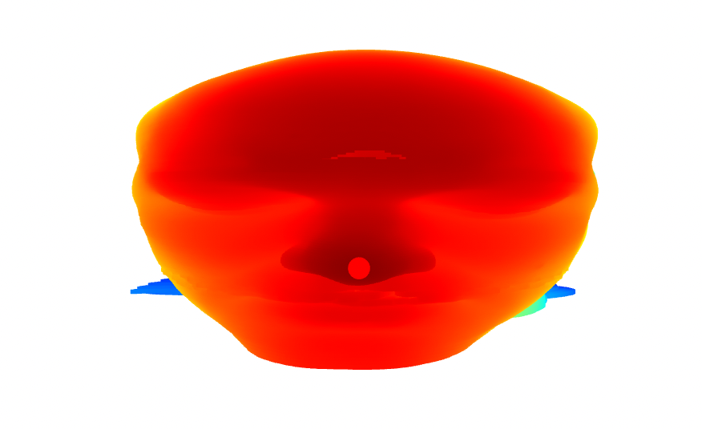

# Task 2: Landmark Detection on a 3D Facial Point Cloud

## Objective
Detect the **tip of the nose** from a 3D facial point cloud.

---

## Approach

1. **Landmark Detection**
   - Center the point cloud.
   - Identify the nose tip as the point with **maximum Z-coordinate** (most protruding).

2. **Visualization**
   - Overlay a red sphere at the detected nose tip for verification.

## Visualization

A red sphere is overlaid at the detected nose tip for visual verification.

This helps ensure the correctness of the landmark detection.

**Figure:** Red sphere indicating detected nose tip.

## Demo

A working demo of the entire pipeline is available in the Jupyter notebook here:  
🔗 [Task_2_Demo.ipynb](https://github.com/TapasKumarDutta1/Tasks/blob/main/Task2/Task_2_Demo.ipynb)

---

## Challenges Encountered

### Pretrained Models
- Attempted to use pretrained landmark detection models.
- These produced inaccurate results in 3D space.

### Curvature-Based Heuristic
- Tried identifying the nose tip as the point of maximum curvature.
- This often misidentified points around the neck region due to local shape variations.

