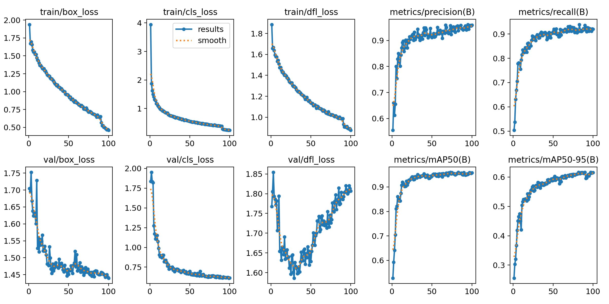
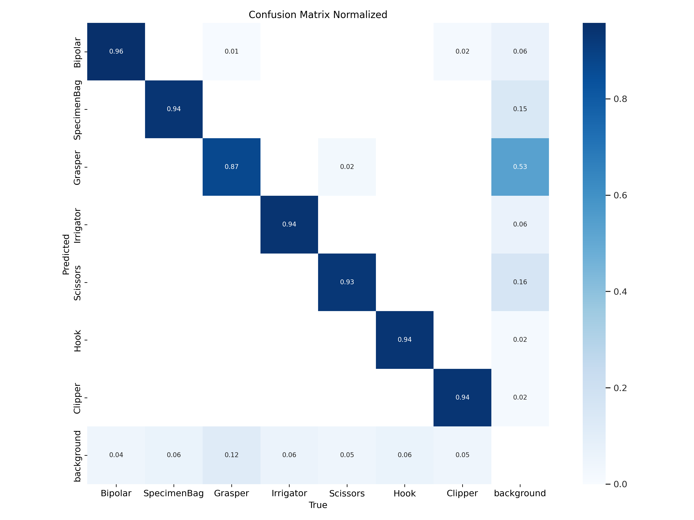
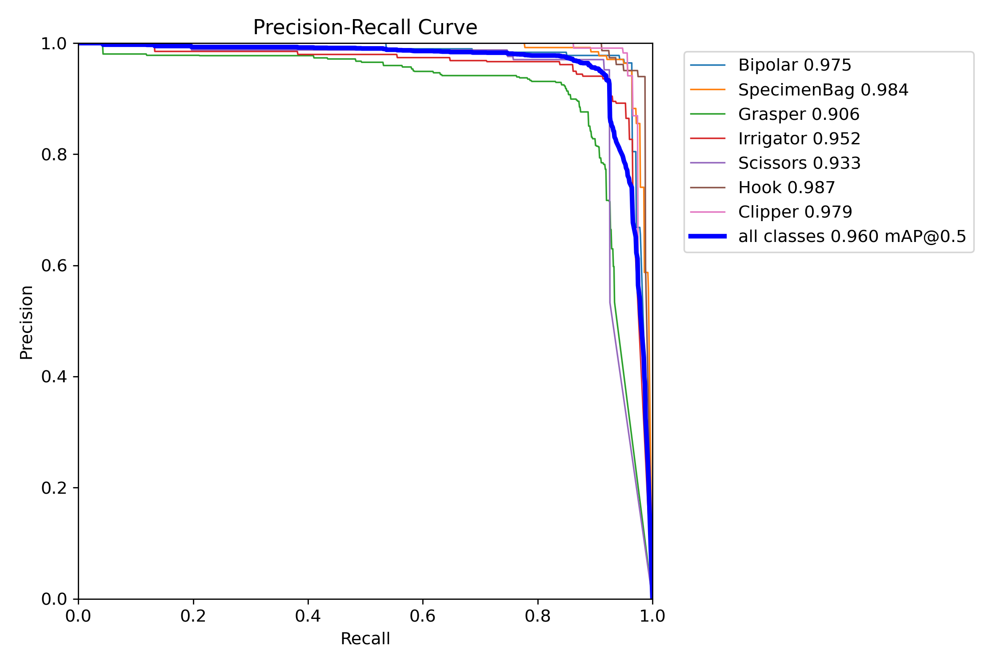
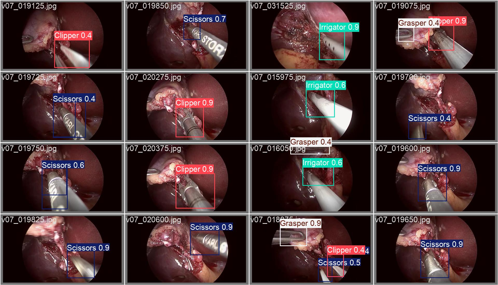
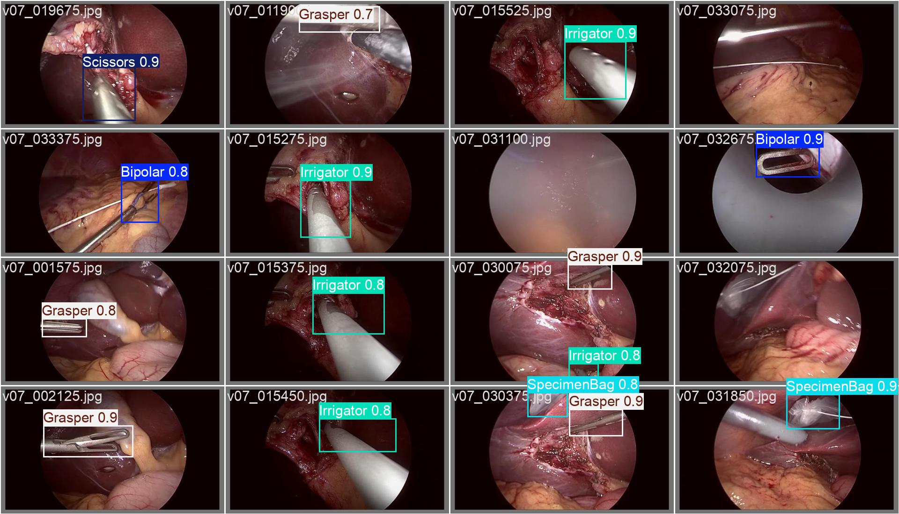
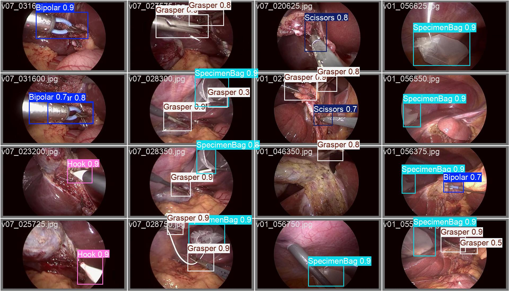

# Surgery Instrument Object Detection Using YOLOv12

## Objective
Detect surgerical tools in images and videos.

## Approach

1. **Dataset Preparation**:
   1. The Dataset consist of train, test and validation ids
   2.  Convert the annotations from PASCAL VOC to YOLO format
2. **Model Training**:
   1. Fine-tuning YOLOv12 on the annotated dataset for accurate classification and localization of surgical instruments.
   2. Save the model's best weights for validation set
3. **Inference and Evaluation**:
   1. Load the best weights for validation set
   2. Running the trained model on test data and video.

## Results

| Confusion Matrix Normalized | PR_Curve |
|:-----------------:|:-----------------:|
|  |  |

## Visualization

### Images
### Videos

## Demo
A working demo of the entire pipeline is available in the Jupyter notebook here:
https://github.com/TapasKumarDutta1/Tasks/blob/main/Task2/Task_2_Demo.ipynb](https://www.kaggle.com/code/tapaskd123/task-1-final-run-100?scriptVersionId=239962497
